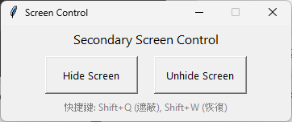

# Screen Hide Utility (螢幕遮蔽工具)
[English](#english) | [中文](#中文)

## <a name="english"></a>English

### Overview

A lightweight screen overlay tool for Windows to instantly hide your second monitor. Perfect for protecting your privacy and maintaining focus during work, presentations, or live streams.

##  Key Features

* **Instant Privacy on Demand**: Designed specifically for your second monitor. Instantly cover it with a black screen using a button or a hotkey to prevent confidential information or personal content from being exposed.
* **Global Hotkey Control**: Works even when the application is running in the background.
    * `Shift + Q`: **Show** the black overlay (hides the screen)
    * `Shift + W`: **Hide** the black overlay (restores the screen)
* **Simple GUI**: An intuitive graphical interface for easy control without needing to memorize commands.
* **Always on Top**: The black overlay is guaranteed to stay on top of all other windows, ensuring a reliable hiding effect.
* **Extremely Lightweight**: The program is incredibly small and consumes almost no system resources.

##  Use Cases

* **Live Streaming & Screen Sharing**: Temporarily hide your secondary monitor while setting up scenes or switching windows to prevent viewers from seeing a cluttered desktop or private files.
* **Working in Public Spaces**: Quickly hide non-work-related content on your extended display when working in a café, library, or co-working space.
* **Presentations & Education**: Keep the projector screen (your second monitor) clean and black while you navigate files or consult notes on your primary display.

### User Interface


##  Getting Started

### Option 1: Direct Download (Recommended)

If you just want to use the tool, the easiest way is to download it from the `Releases` page.

1.  Go to the **[Releases Page](https://github.com/StephenwwW/Screen-Hide-Utility/releases)** 
2.  Download the latest version of `hide_screen.exe`.
3.  Double-click to run. No installation is required.

### Option 2: Run from Source (For Developers)

1.  Ensure you have Python 3 installed.
2.  Clone the repository:
    ```bash
    git clone https://github.com/StephenwwW/Screen-Hide-Utility.git
    cd Screen-Hide-Utility
    ```
3.  Install the required dependencies:
    ```bash
    pip install -r requirements.txt
    ```
4.  Run the script:
    ```bash
    python hide_screen.py
    ```

##  Building the .exe from Source

If you've modified the source code and want to create your own `.exe` file, you can use the included `build_hide_screen.bat` script.

1.  **Install the build tool**:
    ```bash
    pip install pyinstaller
    ```

2.  **(Optional) Install UPX for Compression**:
    To significantly reduce the size of the final `.exe` file, using UPX is recommended.
    * Download the latest version from the **[UPX GitHub Releases page](https://github.com/upx/upx/releases)**.
    * Extract the archive and place the entire folder (e.g., `upx-4.2.4-win64`) on your **Desktop**, as the build script defaults to this path.

3.  **Run the Build Script**:
    Simply double-click `build_hide_screen.bat`. The script will automatically detect UPX (if available) and package the application. The new `hide_screen.exe` will appear on your Desktop upon completion.

##  License

This project is licensed under the [MIT License](Screen%20Hide%20Utility/LICENSE).


## <a name="中文"></a>中文

### 功能概覽

使用於 Windows系統的螢幕遮蔽工具，能以全黑畫面快速覆蓋第二個螢幕。無論是工作、簡報或直播，它都能完美保護您的畫面隱私，並減少不必要的干擾。

##  主要特色

* **一鍵遮蔽，保護隱私**: 專為第二螢幕設計，按下按鈕或快捷鍵，立即用全黑畫面覆蓋，防止機密資訊或私人內容意外曝光。
* **全域快捷鍵，隨時調用**: 程式在背景時也暢行無阻！
    * `Shift + Q`: **顯示** 黑色遮罩 (遮蔽螢幕)
    * `Shift + W`: **隱藏** 黑色遮罩 (恢復螢幕)
* **簡易圖形介面**: 提供直覺的圖形化介面，操作簡單，無需記憶指令。
* **絕對置頂，確保效果**: 遮罩層永遠顯示在所有視窗的最頂層，確保遮蔽效果不被其他應用程式干擾。
* **輕量無負擔**: 程式極為輕巧，幾乎不佔用任何系統資源。

##  使用情境

* **直播與螢幕分享**: 在準備畫面或切換視窗時，可暫時遮蔽副螢幕，避免觀眾看到雜亂的桌面或私人檔案。
* **公開場合工作**: 在咖啡廳、圖書館等公共場所使用延伸螢幕時，可快速隱藏非工作畫面，保護隱私。
* **教育與簡報**: 演講者可以在主螢幕操作的同時，保持副螢幕（投影幕）的畫面純淨，避免顯示電腦後台或備忘稿。

## 軟體截圖


##  如何開始

### 選項 1: 直接執行 (推薦)

如果您只是想使用這個工具，最簡單的方式是從 `Releases` 頁面下載。

1.  前往本專案的 **[Releases 頁面](https://github.com/StephenwwW/Screen-Hide-Utility/releases)**
2.  下載最新版本的 `hide_screen.pyw。
3.  直接雙擊執行，無需安裝。

### 選項 2: 從原始碼執行 (開發者)

1.  確認您的電腦已安裝 Python 3。
2.  複製本專案：
    ```bash
    git clone https://github.com/StephenwwW/Screen-Hide-Utility.git
    cd Screen-Hide-Utility
    ```
    
3.  安裝相依套件：
    ```bash
    pip install -r requirements.txt
    ```
4.  執行主程式：
    ```bash
    python hide_screen.py
    ```

##  打包為 .exe 獨立執行檔

如果您修改了原始碼，並希望建立自己的 `.exe` 檔案，可以使用專案內附的 `build_hide_screen.bat` 腳本。

1.  **安裝建置工具**:
    ```bash
    pip install pyinstaller
    ```

2.  **(可選) 安裝 UPX 壓縮工具**:
    為了讓打包出來的 `.exe` 檔案體積更小，建議使用 UPX。
    * 前往 **[UPX 的 GitHub Releases 頁面](https://github.com/upx/upx/releases)** 下載最新版。
    * 解壓縮後，將整個資料夾 (例如 `upx-4.2.4-win64`) 放置在您的 **桌面** 上，以符合打包腳本的預設路徑。

3.  **執行打包**:
    直接雙擊執行 `build_hide_screen.bat`，腳本將會自動尋找 UPX 並進行打包。完成後，新的 `hide_screen.exe` 檔案將會出現在您的桌面上。

## 版權許可

本專案採用 [MIT License](Screen%20Hide%20Utility/LICENSE) 授權。


